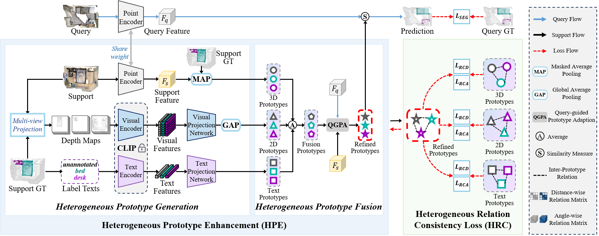

# Few-shot 3D Point Cloud Semantic Segmentation via Relation Consistency guided Heterogeneous Prototypes [[pdf](https://ieeexplore.ieee.org/stamp/stamp.jsp?tp=&arnumber=10948324)]


## Overview




## Running 

**Data preparation please follow [attMPTI](https://github.com/Na-Z/attMPTI).**

**Installation please follow [attMPTI](https://github.com/Na-Z/attMPTI) and [PointCLIP](https://github.com/ZrrSkywalker/PointCLIP) .**


### Training

Pretrain the segmentor which includes feature extractor module on the available training set:

```bash
bash scripts/pretrain_segmentor.sh
```

Train our method under few-shot setting:

```bash
bash scripts/train_RCHP.sh
```

### Evaluation

Test our method under few-shot setting:

```bash
bash scripts/eval_RCHP.sh
```

Note that the above scripts are used for 2-way 1-shot on S3DIS ($S^0$ and $S^1$). Please modify the corresponding hyperparameters to conduct experiments on other settings. 


## Quick Start

**Step 1: Add Testing Episode Files**

Place the testing episode files for [S3DIS](#) into the `datasets` directory.

📁 Shared File: **S3DIS.zip**  
🔗 Baidu Drive: [https://pan.baidu.com/s/1APR_6PUyvhNbDHI8ugnMqQ?pwd=6aez](https://pan.baidu.com/s/1APR_6PUyvhNbDHI8ugnMqQ?pwd=6aez)  
🔑 Extraction Code: `6aez`

**Step 2: Add Our Checkpoints**

Place the provided checkpoint and log files for [RCHP](#) into the [`log_s3dis`](https://github.com/lily-wei0211/RCHP/tree/main/log_s3dis) directory.

📁 Shared File: **RCHP.zip**  
🔗 Baidu Drive: [https://pan.baidu.com/s/10c8D8gERovIH8RPhAmsp-g?pwd=csfh](https://pan.baidu.com/s/10c8D8gERovIH8RPhAmsp-g?pwd=csfh)  
🔑 Extraction Code: `csfh`

**Step 3: Run Evaluation**

Use the following command to evaluate the model.

```bash
bash scripts/eval_RCHP.sh
```

<details><summary>📋 Example Evaluation Log on S3DIS 2-way 1-shot $S^0$ (click to expand)</summary>
<pre style="white-space: pre-wrap;">
[Eval] Iter: 100 | Loss: 1.0533 | ACC: 0.9326 | 2024-08-10 13:21:38.014235
[Eval] Iter: 200 | Loss: 1.5929 | ACC: 0.8042 | 2024-08-10 13:22:37.980587
[Eval] Iter: 300 | Loss: 0.8993 | ACC: 0.8479 | 2024-08-10 13:23:09.869580
[Eval] Iter: 400 | Loss: 0.7140 | ACC: 0.9441 | 2024-08-10 13:24:10.499792
[Eval] Iter: 500 | Loss: 1.1024 | ACC: 0.8337 | 2024-08-10 13:24:42.185983
[Eval] Iter: 600 | Loss: 0.6583 | ACC: 0.9490 | 2024-08-10 13:25:39.814339
[Eval] Iter: 700 | Loss: 1.0158 | ACC: 0.8059 | 2024-08-10 13:26:15.002902
[Eval] Iter: 800 | Loss: 1.4702 | ACC: 0.7383 | 2024-08-10 13:27:08.139206
[Eval] Iter: 900 | Loss: 1.1131 | ACC: 0.9045 | 2024-08-10 13:27:48.081734
[Eval] Iter: 1000 | Loss: 1.5233 | ACC: 0.7219 | 2024-08-10 13:28:36.645118
[Eval] Iter: 1100 | Loss: 1.5226 | ACC: 0.7642 | 2024-08-10 13:29:20.406276
[Eval] Iter: 1200 | Loss: 1.1966 | ACC: 0.9148 | 2024-08-10 13:30:04.941568
[Eval] Iter: 1300 | Loss: 0.5124 | ACC: 0.9380 | 2024-08-10 13:30:54.752465
[Eval] Iter: 1400 | Loss: 0.5750 | ACC: 0.9629 | 2024-08-10 13:31:33.943071
[Eval] Iter: 1500 | Loss: 2.2027 | ACC: 0.7297 | 2024-08-10 13:32:27.766669
*****Test Classes: [3, 11, 10, 0, 8, 4]*****  
----- [class 0]  IoU: 0.715767 -----  
----- [class 1]  IoU: 0.474932 -----  
----- [class 2]  IoU: 0.724127 -----  
----- [class 3]  IoU: 0.734209 -----  
----- [class 4]  IoU: 0.571884 -----  
----- [class 5]  IoU: 0.837250 -----  
----- [class 6]  IoU: 0.707857 -----  

=====[TEST] Loss: 1.4090 | Mean IoU: 0.675043 =====
</pre>
</details>


<details><summary>📋 Example Evaluation Log on S3DIS 2-way 1-shot $S^1$     (click to expand)</summary>
<pre style="white-space: pre-wrap;">
[Eval] Iter: 100 | Loss: 0.9784 | ACC: 0.9463 | 2024-08-10 13:15:17.832706
[Eval] Iter: 200 | Loss: 0.6016 | ACC: 0.9517 | 2024-08-10 13:15:57.000090
[Eval] Iter: 300 | Loss: 0.9990 | ACC: 0.9055 | 2024-08-10 13:16:57.724862
[Eval] Iter: 400 | Loss: 1.3111 | ACC: 0.8167 | 2024-08-10 13:17:30.574353
[Eval] Iter: 500 | Loss: 2.4800 | ACC: 0.4656 | 2024-08-10 13:18:29.042038
[Eval] Iter: 600 | Loss: 0.9078 | ACC: 0.8582 | 2024-08-10 13:19:03.548966
[Eval] Iter: 700 | Loss: 1.4342 | ACC: 0.8320 | 2024-08-10 13:19:57.532313
[Eval] Iter: 800 | Loss: 2.9380 | ACC: 0.7354 | 2024-08-10 13:20:38.388914
[Eval] Iter: 900 | Loss: 0.7226 | ACC: 0.9097 | 2024-08-10 13:21:26.564371
[Eval] Iter: 1000 | Loss: 0.6154 | ACC: 0.9597 | 2024-08-10 13:22:11.489195
[Eval] Iter: 1100 | Loss: 1.0837 | ACC: 0.7888 | 2024-08-10 13:22:54.670297
[Eval] Iter: 1200 | Loss: 1.0722 | ACC: 0.9736 | 2024-08-10 13:23:43.359266
[Eval] Iter: 1300 | Loss: 1.0356 | ACC: 0.7861 | 2024-08-10 13:24:23.053158
[Eval] Iter: 1400 | Loss: 2.5793 | ACC: 0.3159 | 2024-08-10 13:25:15.799816
[Eval] Iter: 1500 | Loss: 1.3327 | ACC: 0.8572 | 2024-08-10 13:25:51.272607
*****Test Classes: [6, 1, 9, 7, 2, 5]*****
----- [class 0]  IoU: 0.799492 -----
----- [class 1]  IoU: 0.779033 -----
----- [class 2]  IoU: 0.722976 -----
----- [class 3]  IoU: 0.841781 -----
----- [class 4]  IoU: 0.694548 -----
----- [class 5]  IoU: 0.662916 -----
----- [class 6]  IoU: 0.764256 -----

=====[TEST] Loss: 1.0739 | Mean IoU: 0.744252 =====
</pre>
</details>

## Checkpoints and Log Files
More checkpoints and log files will be released soon. Please stay tuned!

## Citation
Please cite our paper if it is helpful to your research:

    @ARTICLE{10948324,
      author={Wei, Lili and Lang, Congyan and Xu, Zheming and Liang, Liqian and Liu, Jun},
      journal={IEEE Transactions on Multimedia}, 
      title={Few-Shot 3D Point Cloud Segmentation via Relation Consistency-Guided Heterogeneous Prototypes}, 
      year={2025},
      volume={27},
      number={},
      pages={3158-3170},
      doi={10.1109/TMM.2025.3557699}
    }


## Acknowledgement
We thank [DGCNN (pytorch)](https://github.com/WangYueFt/dgcnn/tree/master/pytorch), [attMPTI](https://github.com/Na-Z/attMPTI), [QGPA](https://github.com/heshuting555/PAP-FZS3D), and [PointCLIP](https://github.com/ZrrSkywalker/PointCLIP) for sharing their source code.
